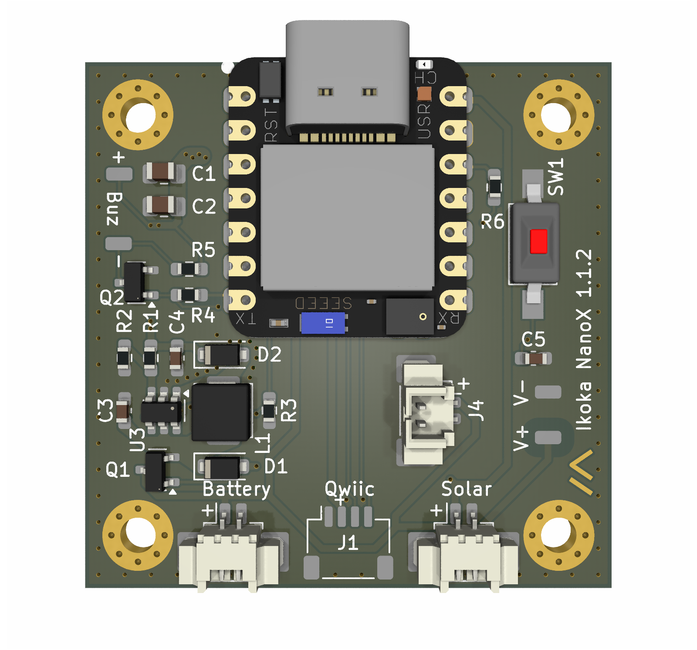
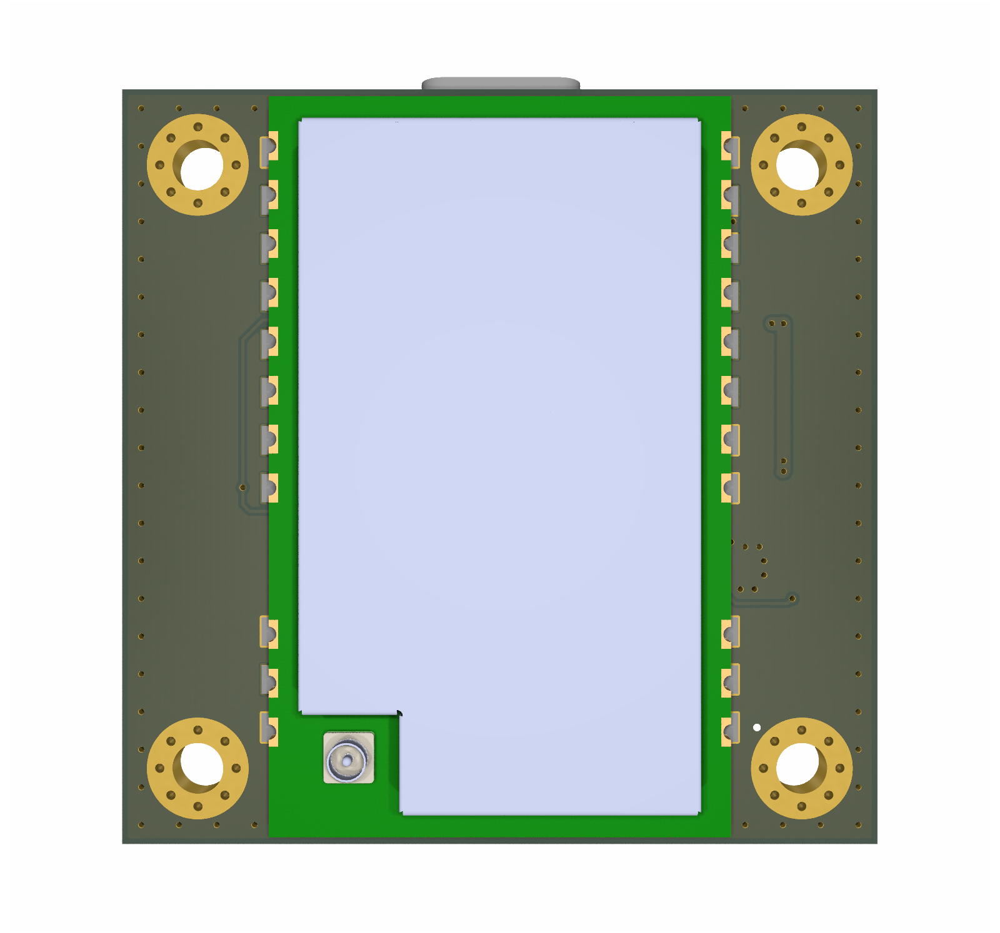
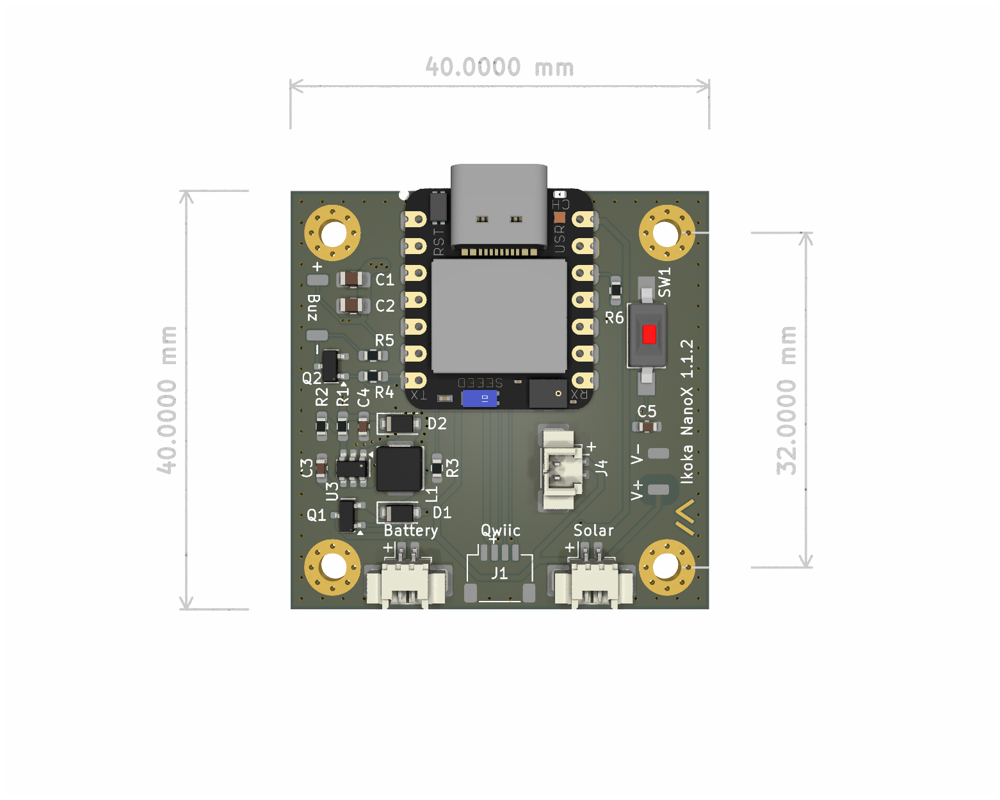
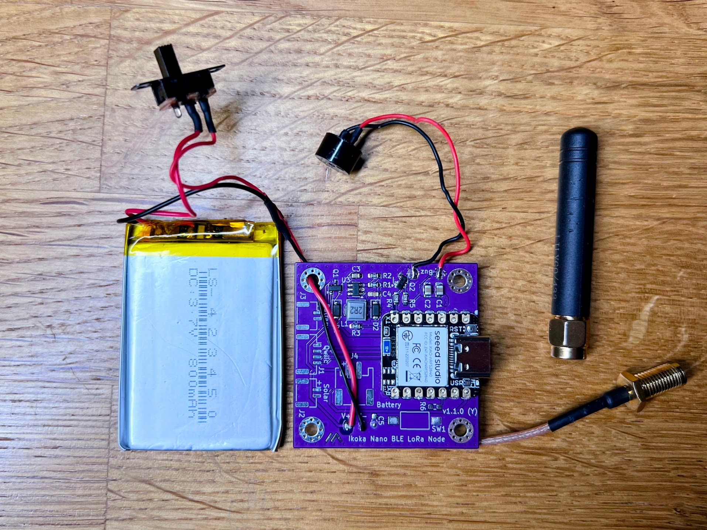
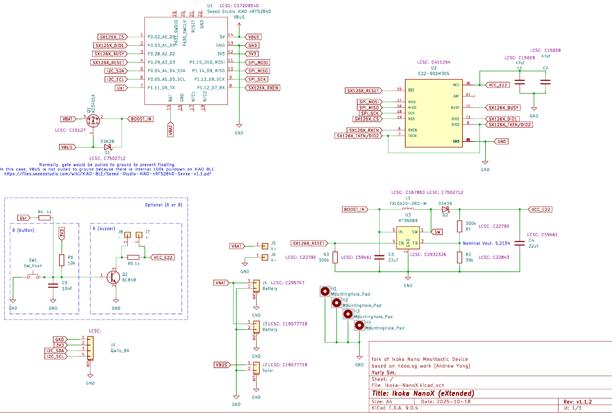
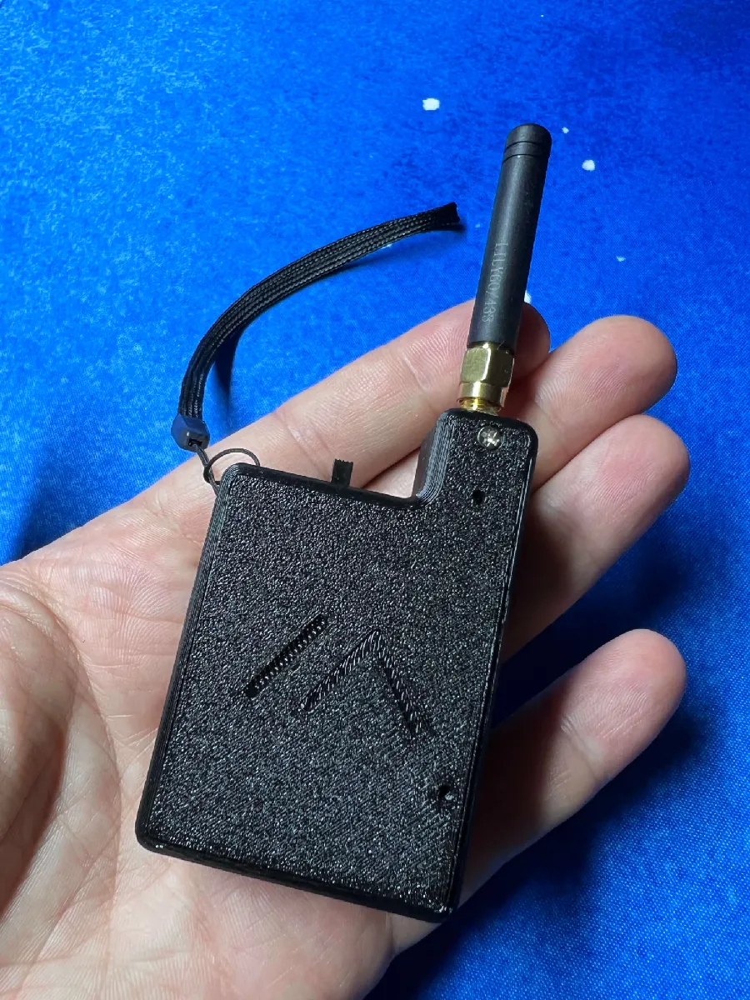
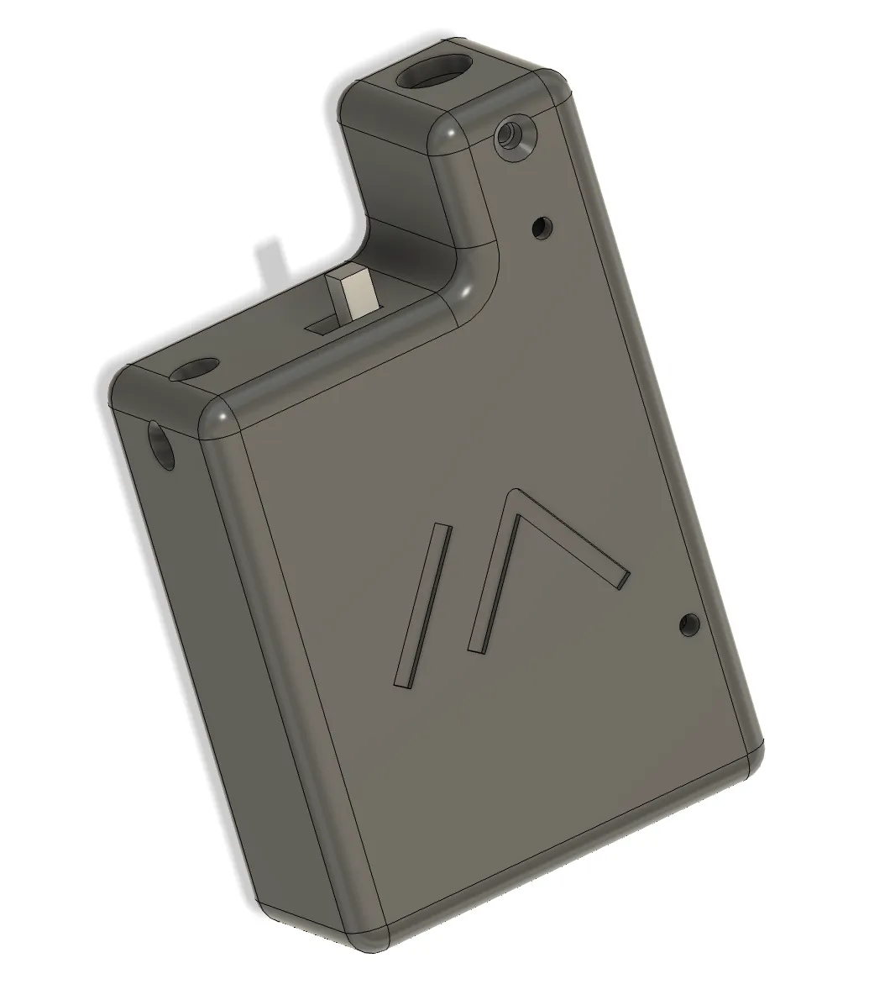

Ikoka NanoX (eXtended) Meshtastic PCB є форком [Ikoka Nano Meshtastic Device](https://github.com/ndoo/ikoka-nano-meshtastic-device) автором якого є [Andrew Yong](https://ndoo.sg/start). Він є модифікацією Ikoka Nano Meshtastic Device та містить деякі нові функції.

## Ikoka NanoX Meshtastic Device

## Можливості

* Малий розмір (40мм x 40мм)
* Економічність (мікроконтролер Seeed Studio XIAO BLE на nRF52840)
* Робота від LiPo акумулятора (1S)
* Підтримка зарядки акумулятора через USB-C
* Підтримка зарядки від сонячної панелі 5В
* Підтримка LoRa передавачів потужністю до 30-33 dBm (1-2 Вт)
* Підтримка OLED через I2C
* Вбудований регулятор напруги 5В
* Звуковий сигналізатор (пищалка) для аудіо-сповіщень
* або кнопка користувача (опціонально 1, з варіантів)

## Відмінності від оригінального Ikoka Nano

* Підтримка бузера, або кнопки
* Окремі площадки під пайку для батареї
* Зміни по підписах на платі для кращого розуміння
* Плата має заокруглені кути (v1.1.2)

## Схема

## Збірка

### Перелік матеріалів (Bill of Materials)

Є інтерактивний [iBom](Ikoka-NanoX-KiCad/bom/ibom.html).

### Замовлення з JLCPCB

Версія плати v1.1.1 замовлялася і працює. Версія v1.1.2 не тестувалася.

### Паяння

Спочатку необхідно запаяти всі SMD компоненти крім мікроконтролера та LoRa модуля.

Подайте живлення 4В на плату та перевірте чи працює перетворювач напруги 5В. На площадці 10 модуля LoRa E22 має бути 5В. Але, щоб запрацював пеертворювач на його ніжці 4 має бути присутній сигнал EN (3-4 В). Цей сигнал подається мікроконтролером, тому для перевірки можна тимчасово під'єднати ніжку 4 (SX126X_RESET) контролера nRF до 4В, або торкнутися туди металевим предметом (на потенціал тіла теж спрацьовувало).

Встановіть плату  Seeed Studio XIAO BLE. Переконайтеся що вона правильно орієнтована і гарно співпадає з площадками для паяння. Припаяйте 2 площадки по діагоналі, перевірте чи не зрушилася, а потім припаяйте всі інші ніжки.

Припаяйте BAT+ через отвір **з протилежного боку** плати. Треба тоненьке жало.

Перевірте чи мікроконтролер реагує на підключення по USB.

Припаяйте LoRa модуль (**антена завжди має бути підключена**).

## Прошивка

### Ціль для Meshtastic

`seeed_xiao_nrf52840_kit`

### Потужність LoRa

У більшості регіонів LoRa максимальна потужність у прошивці обмежена 20 dBm, тому 1-2 Вт не будуть задіяні. Щоб активувати повну потужність, потрібно змінити прошивку та встановити 22 dBm — тоді LoRa модуль eByte автоматично працюватиме на максимумі.

## Корпус

Є моя 3D модель корпусу **Ikoka NanoX Pocket Case** на [Printables](https://www.printables.com/model/1440471-ikoka-nano-pocket-case) (не тестував з v1.1.2, але має підійти)/

## Участь у проєкті

Використовуйте [Github Flow](https://guides.github.com/introduction/flow/): створюйте гілку, робіть коміти та створюйте pull request.

## Підтримка

Обговорюємо тут лише **PCB**, не сам Meshtastic.
Я не можу гарантувати підтримку, але спробую допомогти, якщо зможу.

Відкривайте issue для питань чи ідей.

## Ліцензія

[GPL v3](https://choosealicense.com/licenses/gpl-3.0/)

[Meshtastic](https://meshtastic.org/)® — зареєстрована торгова марка Meshtastic LLC. Програмні компоненти Meshtastic поширюються під різними ліцензіями. Жодних гарантій не надається — використовуйте на власний ризик.

Ця плата Ikoka NanoX базується на [Ikoka Nano Meshtastic Device](https://github.com/ndoo/ikoka-nano-meshtastic-device) яка поширюється з ліцензією [CERN-OHL-P](https://cern-ohl.web.cern.ch/).